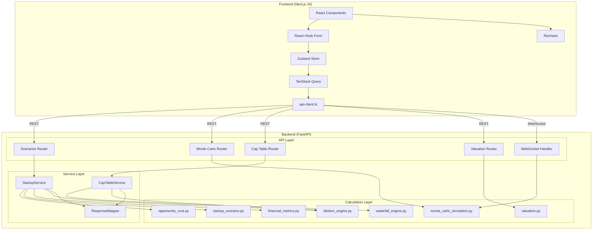
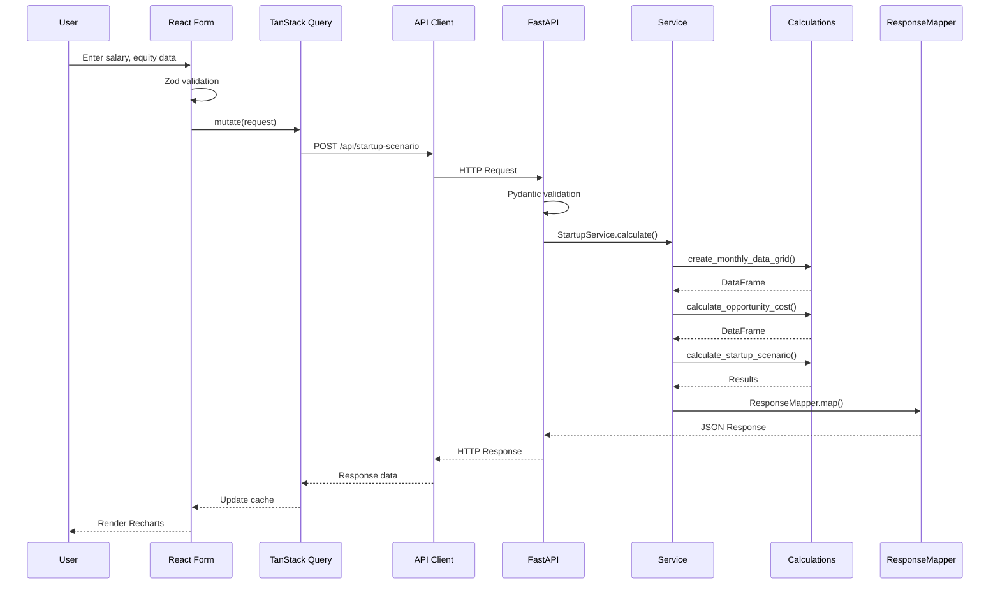

# Worth It - Comprehensive Codebase Analysis

> **Generated**: December 23, 2025
> **Version**: 1.0.0
> **Status**: Production Ready

---

## Table of Contents

1. [Project Overview](#1-project-overview)
2. [Directory Structure Analysis](#2-directory-structure-analysis)
3. [File-by-File Breakdown](#3-file-by-file-breakdown)
4. [API Endpoints Analysis](#4-api-endpoints-analysis)
5. [Architecture Deep Dive](#5-architecture-deep-dive)
6. [Environment & Setup Analysis](#6-environment--setup-analysis)
7. [Technology Stack Breakdown](#7-technology-stack-breakdown)
8. [Visual Architecture Diagram](#8-visual-architecture-diagram)
9. [Key Insights & Recommendations](#9-key-insights--recommendations)

---

## 1. Project Overview

### What is Worth It?

**Worth It** is a modern financial analysis tool designed to help employees and founders evaluate startup job offers. It provides real-time calculations, Monte Carlo simulations, cap table modeling, and interactive visualizations.

### Project Type

- **Application Type**: Full-stack web application (monorepo)
- **Domain**: Financial Technology (FinTech) / HR Tech
- **Target Users**:
  - **Employees**: Evaluating RSU/Stock Option compensation packages
  - **Founders**: Managing cap tables and waterfall distributions

### Core Features

| Mode | Features |
|------|----------|
| **Employee Mode** | Scenario analysis, Monte Carlo simulations, RSU vs Stock Options comparison, What-If analysis |
| **Founder Mode** | Cap table management, Waterfall analysis, Dilution modeling, Preference stack editing |
| **Shared** | Command palette, Auto-save, PDF/CSV export, Dark/Light mode, Accessibility features |

### Tech Stack Summary

| Layer | Technologies |
|-------|-------------|
| **Frontend** | Next.js 16, React 19, TypeScript, TanStack Query, Zustand, shadcn/ui, Recharts |
| **Backend** | FastAPI, Python 3.13+, Pydantic, NumPy, Pandas, SciPy |
| **Testing** | Vitest (1182 unit tests), pytest (338 tests), Playwright (31 E2E test suites) |
| **Infrastructure** | uv (Python), npm (Node.js), GitHub Actions CI/CD |

### Key Statistics

| Metric | Count |
|--------|-------|
| Backend Tests | 338 |
| Frontend Unit Tests | 1,182 |
| E2E Test Suites | 31 |
| API Endpoints | ~20 REST + 1 WebSocket |
| React Components | 50+ |
| Calculation Modules | 15 |

---

## 2. Directory Structure Analysis

```
worth_it/
├── backend/                      # FastAPI Python backend
│   ├── src/worth_it/
│   │   ├── api/                  # API layer (routers, dependencies)
│   │   │   ├── __init__.py       # FastAPI app creation & middleware
│   │   │   ├── dependencies.py   # Shared dependencies (limiter, services)
│   │   │   └── routers/          # Domain-specific API routers
│   │   │       ├── cap_table.py  # Cap table & waterfall endpoints
│   │   │       ├── monte_carlo.py # Monte Carlo & sensitivity endpoints
│   │   │       ├── scenarios.py  # Scenario calculation endpoints
│   │   │       └── valuation.py  # Valuation method endpoints
│   │   ├── calculations/         # Pure Python calculation modules
│   │   │   ├── base.py           # EquityType enum, base utilities
│   │   │   ├── cap_table.py      # SAFE/Note conversion logic
│   │   │   ├── comparison.py     # Scenario comparison logic
│   │   │   ├── conversion_engine.py # Instrument conversion engine
│   │   │   ├── dilution.py       # Dilution calculations
│   │   │   ├── dilution_engine.py # Fluent pipeline dilution engine
│   │   │   ├── financial_metrics.py # IRR, NPV calculations
│   │   │   ├── investment_strategies.py # Investment frequency logic
│   │   │   ├── monte_carlo_simulation.py # MC simulation core
│   │   │   ├── opportunity_cost.py # Opportunity cost calculations
│   │   │   ├── startup_scenario.py # Startup scenario analysis
│   │   │   ├── valuation.py      # Valuation methods (DCF, VC)
│   │   │   ├── waterfall.py      # Waterfall distribution logic
│   │   │   └── waterfall_engine.py # Waterfall calculation engine
│   │   ├── services/             # Business logic orchestration
│   │   │   ├── cap_table_service.py # Cap table operations
│   │   │   ├── serializers.py    # Response mapping & serialization
│   │   │   └── startup_service.py # Startup scenario orchestration
│   │   ├── config.py             # Application configuration
│   │   ├── exceptions.py         # Custom exception hierarchy
│   │   ├── models.py             # Pydantic request/response models
│   │   ├── monte_carlo.py        # Monte Carlo simulation engine
│   │   └── types.py              # TypedDict definitions
│   ├── tests/                    # pytest test suite
│   └── pyproject.toml            # Python dependencies & config
│
├── frontend/                     # Next.js TypeScript frontend
│   ├── app/                      # Next.js App Router pages
│   ├── components/
│   │   ├── cap-table/            # Cap table management UI
│   │   ├── charts/               # Recharts visualizations
│   │   ├── dashboard/            # Dashboard components
│   │   ├── decision/             # Decision framework UI
│   │   ├── forms/                # React Hook Form components
│   │   ├── layout/               # App shell, header, sidebar
│   │   ├── onboarding/           # Welcome flow components
│   │   ├── results/              # Results display components
│   │   ├── scenarios/            # Scenario management UI
│   │   ├── templates/            # Template components
│   │   ├── ui/                   # shadcn/ui base components
│   │   ├── valuation/            # Valuation calculator UI
│   │   └── walkthrough/          # Feature walkthrough UI
│   ├── lib/
│   │   ├── api-client.ts         # Type-safe API client + hooks
│   │   ├── constants/            # App-wide constants
│   │   ├── hooks/                # Custom React hooks
│   │   ├── providers.tsx         # React context providers
│   │   ├── schemas.ts            # Zod validation schemas
│   │   ├── store.ts              # Zustand state store
│   │   └── utils.ts              # General utilities
│   ├── __tests__/                # Vitest unit tests
│   ├── docs/design-references/   # Fundcy design reference images
│   └── package.json              # Node.js dependencies
│
├── playwright/                   # E2E test suite
│   ├── fixtures/                 # Test fixtures
│   ├── utils/                    # Test utilities & helpers
│   └── tests/                    # 31 E2E test files
│
├── scripts/                      # Utility scripts
│   ├── run-e2e-tests.sh          # E2E test runner
│   └── generate-types.sh         # Type generation script
│
├── docs/                         # Additional documentation
├── CLAUDE.md                     # Development guidelines
├── POWERHORSE.md                 # Vision & philosophy
└── README.md                     # Project overview
```

### Directory Purpose Summary

| Directory | Purpose | Key Files |
|-----------|---------|-----------|
| `backend/src/worth_it/api/` | HTTP layer, routing, middleware | `__init__.py`, `routers/*.py` |
| `backend/src/worth_it/calculations/` | Pure calculation functions | 15 domain modules |
| `backend/src/worth_it/services/` | Business logic orchestration | 3 service files |
| `frontend/components/` | React UI components | 12 component directories |
| `frontend/lib/` | Utilities, state, API client | `api-client.ts`, `store.ts` |
| `playwright/tests/` | End-to-end tests | 31 test files |

---

## 3. File-by-File Breakdown

### Backend Core Files

#### API Layer

| File | Lines | Purpose |
|------|-------|---------|
| `api/__init__.py` | ~175 | FastAPI app, CORS, exception handlers, router mounting |
| `api/dependencies.py` | ~200 | Rate limiter, service instances, error response helpers |
| `api/routers/scenarios.py` | ~300 | Scenario calculation endpoints (monthly grid, opportunity cost, startup scenario, IRR, NPV) |
| `api/routers/monte_carlo.py` | ~400 | Monte Carlo REST + WebSocket endpoints, sensitivity analysis |
| `api/routers/cap_table.py` | ~250 | Cap table conversion, waterfall, dilution preview |
| `api/routers/valuation.py` | ~250 | Valuation methods (Revenue Multiple, DCF, VC Method) |

#### Calculation Modules

| File | Lines | Purpose |
|------|-------|---------|
| `calculations/base.py` | ~50 | EquityType enum, `annual_to_monthly_roi()` |
| `calculations/opportunity_cost.py` | ~200 | `create_monthly_data_grid()`, `calculate_annual_opportunity_cost()` |
| `calculations/startup_scenario.py` | ~300 | `calculate_startup_scenario()` for RSU/Options |
| `calculations/dilution_engine.py` | ~400 | Fluent pipeline `DilutionPipeline`, `calculate_dilution_schedule()` |
| `calculations/financial_metrics.py` | ~150 | `calculate_irr()`, `calculate_npv()`, `calculate_dilution_from_valuation()` |
| `calculations/cap_table.py` | ~200 | `calculate_interest()`, `calculate_conversion_price()`, `convert_instruments()` |
| `calculations/waterfall.py` | ~300 | `calculate_waterfall()` distribution |
| `calculations/monte_carlo_simulation.py` | ~250 | Core simulation logic |
| `calculations/valuation.py` | ~200 | DCF, Revenue Multiple, VC Method calculations |
| `calculations/comparison.py` | ~150 | Scenario comparison logic |

#### Models & Services

| File | Lines | Purpose |
|------|-------|---------|
| `models.py` | ~810 | All Pydantic request/response models |
| `monte_carlo.py` | ~700 | Monte Carlo simulation engine |
| `services/startup_service.py` | ~230 | StartupService orchestration |
| `services/cap_table_service.py` | ~200 | CapTableService orchestration |
| `services/serializers.py` | ~350 | ResponseMapper, column mapping, type conversion |
| `types.py` | ~270 | TypedDict definitions for type safety |
| `config.py` | ~240 | Settings class, environment variable loading |
| `exceptions.py` | ~30 | WorthItError, CalculationError, ValidationError |

### Frontend Core Files

#### API & State

| File | Lines | Purpose |
|------|-------|---------|
| `lib/api-client.ts` | ~840 | Axios client, TanStack Query hooks, WebSocket hook |
| `lib/schemas.ts` | ~600 | Zod schemas (mirrors Pydantic models) |
| `lib/store.ts` | ~400 | Zustand store (appMode, globalSettings, capTable) |
| `lib/providers.tsx` | ~100 | React Query, Theme, Zustand providers |

#### Utilities

| File | Purpose |
|------|---------|
| `lib/format-utils.ts` | Number/currency formatting |
| `lib/export-utils.ts` | CSV/PDF export utilities |
| `lib/dilution-utils.ts` | Dilution calculation helpers |
| `lib/employee-scenario-utils.ts` | Employee equity scenario helpers |
| `lib/scenario-utils.ts` | Scenario management helpers |
| `lib/validation.ts` | Form validation helpers |

#### Component Directories

| Directory | Components | Purpose |
|-----------|------------|---------|
| `components/forms/` | 10+ | Form inputs, sliders, selectors |
| `components/charts/` | 8+ | Recharts visualizations (histogram, ECDF, box plot, etc.) |
| `components/results/` | 5+ | Results dashboard, scenario results |
| `components/cap-table/` | 10+ | Cap table editor, funding rounds, waterfall |
| `components/dashboard/` | 3+ | Mode-specific dashboards |
| `components/ui/` | 30+ | shadcn/ui base components |

### Test Files

#### Backend Tests (`backend/tests/`)

| File | Test Count | Coverage |
|------|------------|----------|
| `test_api.py` | ~50 | API endpoint tests |
| `test_calculations.py` | ~100 | Core calculation tests |
| `test_integration.py` | ~50 | End-to-end workflow tests |
| `test_models.py` | ~40 | Pydantic model validation |
| `test_services.py` | ~30 | Service layer tests |
| `test_monte_carlo.py` | ~30 | Monte Carlo simulation tests |
| **Total** | **338** | |

#### Frontend Tests (`frontend/__tests__/`)

| Category | Test Files | Tests |
|----------|------------|-------|
| Components | 40+ | 600+ |
| Hooks | 10+ | 150+ |
| Utils | 15+ | 200+ |
| Integration | 5+ | 100+ |
| **Total** | **78** | **1,182** |

#### E2E Tests (`playwright/tests/`)

| File | Purpose |
|------|---------|
| `01-api-health.spec.ts` | API connection tests |
| `02-form-interactions.spec.ts` | Form input validation |
| `03-rsu-form.spec.ts` | RSU equity form |
| `04-stock-options-form.spec.ts` | Stock options form |
| `05-rsu-scenario-flow.spec.ts` | Full RSU scenario E2E |
| `06-stock-options-scenario-flow.spec.ts` | Full options E2E |
| `07-monte-carlo.spec.ts` | Monte Carlo simulation |
| `08-ui-features.spec.ts` | Theme, accessibility |
| `09-waterfall-analysis.spec.ts` | Waterfall distribution |
| `10-export-functionality.spec.ts` | CSV/PDF export |
| `11-scenario-management.spec.ts` | Scenario CRUD |
| `12-api-validation.spec.ts` | API input validation |
| `13-calculation-accuracy.spec.ts` | Numerical accuracy |
| `14-websocket-integration.spec.ts` | WebSocket Monte Carlo |
| `15-cross-feature.spec.ts` | Multi-feature integration |
| `16-error-handling.spec.ts` | Error boundary tests |
| `17-completed-rounds.spec.ts` | Completed funding rounds |
| `18-bottom-nav.spec.ts` | Bottom navigation |
| + 13 more... | Additional UI tests |

---

## 4. API Endpoints Analysis

### Endpoint Summary

The API is organized into 4 domain routers:

#### Scenarios Router (`/api/`)

| Method | Path | Purpose | Request Model | Response Model |
|--------|------|---------|---------------|----------------|
| POST | `/api/monthly-data-grid` | Create monthly salary grid | `MonthlyDataGridRequest` | `MonthlyDataGridResponse` |
| POST | `/api/opportunity-cost` | Calculate opportunity cost | `OpportunityCostRequest` | `OpportunityCostResponse` |
| POST | `/api/startup-scenario` | Calculate startup scenario | `StartupScenarioRequest` | `StartupScenarioResponse` |
| POST | `/api/irr` | Calculate Internal Rate of Return | `IRRRequest` | `IRRResponse` |
| POST | `/api/npv` | Calculate Net Present Value | `NPVRequest` | `NPVResponse` |
| POST | `/api/scenarios/compare` | Compare multiple scenarios | `ScenarioComparisonRequest` | `ScenarioComparisonResponse` |

#### Monte Carlo Router (`/api/` + `/ws/`)

| Method | Path | Purpose | Request Model | Response Model |
|--------|------|---------|---------------|----------------|
| POST | `/api/monte-carlo` | Run Monte Carlo simulation (REST) | `MonteCarloRequest` | `MonteCarloResponse` |
| POST | `/api/sensitivity-analysis` | Run sensitivity analysis | `SensitivityAnalysisRequest` | `SensitivityAnalysisResponse` |
| WS | `/ws/monte-carlo` | Monte Carlo with progress | JSON messages | Progress + Results |

#### Cap Table Router (`/api/`)

| Method | Path | Purpose | Request Model | Response Model |
|--------|------|---------|---------------|----------------|
| POST | `/api/dilution` | Calculate dilution from valuation | `DilutionFromValuationRequest` | `DilutionFromValuationResponse` |
| POST | `/api/dilution/preview` | Preview funding round dilution | `DilutionPreviewRequest` | `DilutionPreviewResponse` |
| POST | `/api/cap-table/convert` | Convert SAFE/Notes to equity | `CapTableConversionRequest` | `CapTableConversionResponse` |
| POST | `/api/waterfall` | Calculate waterfall distribution | `WaterfallRequest` | `WaterfallResponse` |

#### Valuation Router (`/api/valuation/`)

| Method | Path | Purpose | Request Model | Response Model |
|--------|------|---------|---------------|----------------|
| POST | `/api/valuation/revenue-multiple` | Revenue multiple valuation | `RevenueMultipleRequest` | `ValuationResultResponse` |
| POST | `/api/valuation/dcf` | DCF valuation | `DCFRequest` | `ValuationResultResponse` |
| POST | `/api/valuation/vc-method` | VC method valuation | `VCMethodRequest` | `ValuationResultResponse` |
| POST | `/api/valuation/compare` | Compare multiple methods | `ValuationCompareRequest` | `ValuationCompareResponse` |

#### Health Check

| Method | Path | Purpose |
|--------|------|---------|
| GET | `/health` | API health check |

### WebSocket Protocol

The Monte Carlo WebSocket (`/ws/monte-carlo`) uses a message-based protocol:

```typescript
// Client → Server
{ ...MonteCarloRequest }

// Server → Client (Progress)
{ type: "progress", current: 500, total: 1000, percentage: 50 }

// Server → Client (Complete)
{ type: "complete", net_outcomes: [...], simulated_valuations: [...] }

// Server → Client (Error)
{ type: "error", error: { code: "...", message: "..." } }
```

### Error Response Format

All errors follow a standardized format:

```json
{
  "error": {
    "code": "VALIDATION_ERROR",
    "message": "Invalid input parameters",
    "details": [
      { "field": "exit_year", "message": "must be between 1 and 20" }
    ]
  }
}
```

Error codes: `VALIDATION_ERROR`, `CALCULATION_ERROR`, `RATE_LIMIT_ERROR`, `NOT_FOUND_ERROR`, `INTERNAL_ERROR`

---

## 5. Architecture Deep Dive

### 3-Tier Architecture

```
┌─────────────────────────────────────────────────────────────┐
│                     FRONTEND (Port 3000)                     │
│  ┌─────────────┐  ┌─────────────┐  ┌─────────────────────┐  │
│  │   Next.js   │  │   React     │  │     TanStack        │  │
│  │  App Router │  │  Components │  │    Query Cache      │  │
│  └──────┬──────┘  └──────┬──────┘  └──────────┬──────────┘  │
│         │                │                     │             │
│         └────────────────┼─────────────────────┘             │
│                          │                                   │
│                    ┌─────┴─────┐                             │
│                    │ api-client│ (Axios + Hooks)             │
│                    └─────┬─────┘                             │
└──────────────────────────┼───────────────────────────────────┘
                           │ HTTP/WebSocket
┌──────────────────────────┼───────────────────────────────────┐
│                     BACKEND (Port 8000)                      │
│                          │                                   │
│  ┌───────────────────────┴───────────────────────────────┐  │
│  │                    API LAYER                           │  │
│  │   FastAPI + Pydantic Validation + Rate Limiting        │  │
│  │   ┌──────────┐ ┌──────────┐ ┌──────────┐ ┌──────────┐ │  │
│  │   │Scenarios │ │Monte     │ │Cap Table │ │Valuation │ │  │
│  │   │Router    │ │Carlo     │ │Router    │ │Router    │ │  │
│  │   └────┬─────┘ └────┬─────┘ └────┬─────┘ └────┬─────┘ │  │
│  └────────┼────────────┼────────────┼────────────┼───────┘  │
│           │            │            │            │          │
│  ┌────────┴────────────┴────────────┴────────────┴───────┐  │
│  │                   SERVICE LAYER                        │  │
│  │   ┌─────────────────┐ ┌─────────────────┐             │  │
│  │   │ StartupService  │ │ CapTableService │             │  │
│  │   │ (orchestration) │ │ (orchestration) │             │  │
│  │   └────────┬────────┘ └────────┬────────┘             │  │
│  │            │                   │                       │  │
│  │   ┌────────┴───────────────────┴───────┐              │  │
│  │   │         ResponseMapper             │              │  │
│  │   │  (column mapping, serialization)   │              │  │
│  │   └────────────────────────────────────┘              │  │
│  └───────────────────────┬───────────────────────────────┘  │
│                          │                                   │
│  ┌───────────────────────┴───────────────────────────────┐  │
│  │               CALCULATION LAYER                        │  │
│  │   Pure Python Functions (NumPy, Pandas, SciPy)         │  │
│  │   ┌────────────┐ ┌────────────┐ ┌────────────────────┐│  │
│  │   │opportunity │ │startup    │ │dilution_engine    ││  │
│  │   │_cost       │ │_scenario  │ │(fluent pipeline)  ││  │
│  │   └────────────┘ └────────────┘ └────────────────────┘│  │
│  │   ┌────────────┐ ┌────────────┐ ┌────────────────────┐│  │
│  │   │financial   │ │waterfall  │ │monte_carlo        ││  │
│  │   │_metrics    │ │_engine    │ │_simulation        ││  │
│  │   └────────────┘ └────────────┘ └────────────────────┘│  │
│  └───────────────────────────────────────────────────────┘  │
└─────────────────────────────────────────────────────────────┘
```

### Data Flow

```
User Input → React Hook Form (client validation)
    ↓
Zod Schema Validation
    ↓
TanStack Query Mutation → API Client (axios)
    ↓
HTTP POST → FastAPI Endpoint
    ↓
Pydantic Model Validation (server validation)
    ↓
Service Layer (orchestration)
    ↓
Calculation Functions (pure Python)
    ↓
ResponseMapper (serialization)
    ↓
JSON Response ← Pydantic Serialization
    ↓
TanStack Query Cache Update
    ↓
React State → Recharts Visualization
```

### Key Design Patterns

#### 1. Fluent Pipeline Pattern (Backend)

Used for complex, multi-step calculations:

```python
# dilution_engine.py
result = (
    DilutionPipeline(years)
    .with_rounds(rounds)
    .classify()
    .apply_historical()
    .apply_safe_conversions()
    .apply_future_rounds()
    .build()
)
```

**Benefits**: Readable, testable, composable, immutable.

#### 2. Service Layer Pattern (Backend)

Orchestrates business logic between API and calculations:

```python
# startup_service.py
class StartupService:
    def calculate_scenario(self, request: StartupScenarioRequest) -> StartupScenarioResponse:
        # 1. Create monthly data grid
        # 2. Calculate opportunity cost
        # 3. Calculate startup scenario
        # 4. Map response
```

#### 3. Discriminated Union Pattern (Both)

Type-safe handling of RSU vs Stock Options:

```python
# Python (Pydantic)
startup_params: RSUParams | StockOptionsParams

# TypeScript (Zod)
startupParams: z.union([RSUParamsSchema, StockOptionsParamsSchema])
```

#### 4. Stale-While-Revalidate Pattern (Frontend)

TanStack Query hooks for smooth UI updates:

```typescript
export function useStartupScenarioQuery(request, enabled) {
  return useQuery({
    queryKey: ["startupScenario", request],
    placeholderData: keepPreviousData,  // SWR
    staleTime: 0,
  });
}
```

### Frontend/Backend Responsibility Split

| Responsibility | Backend | Frontend |
|----------------|---------|----------|
| Business logic | ✅ | ❌ |
| Calculations | ✅ | ❌ |
| Data validation | ✅ (Pydantic) | ✅ (Zod - UX only) |
| Data transformations | ✅ | ❌ |
| UI rendering | ❌ | ✅ |
| User interaction | ❌ | ✅ |
| Display formatting | ❌ | ✅ |
| Type conversion (snake → camel) | ❌ | ✅ |

**Key Principle**: All business logic lives in the backend. The frontend calls APIs and renders results.

---

## 6. Environment & Setup Analysis

### Prerequisites

| Requirement | Version | Purpose |
|-------------|---------|---------|
| Python | 3.13+ | Backend runtime |
| Node.js | 18+ | Frontend runtime |
| uv | Latest | Python dependency management |
| npm | Latest | Node.js package management |

### Backend Setup

```bash
cd backend
uv sync                    # Install dependencies
uv sync --group dev        # Include dev dependencies
```

**Environment Variables** (`backend/.env`):

```bash
API_HOST=0.0.0.0          # Default: 0.0.0.0
API_PORT=8000             # Default: 8000
ENVIRONMENT=development   # development | production
CORS_ORIGINS=http://localhost:3000  # Comma-separated
LOG_LEVEL=INFO            # DEBUG | INFO | WARNING | ERROR
MAX_SIMULATIONS=100000    # Monte Carlo limit
RATE_LIMIT_PER_MINUTE=60  # API rate limit
```

### Frontend Setup

```bash
cd frontend
npm install               # Install dependencies
```

**Environment Variables** (`frontend/.env.local`):

```bash
NEXT_PUBLIC_API_URL=http://localhost:8000  # Backend URL
NEXT_PUBLIC_WS_URL=ws://localhost:8000     # Optional WebSocket URL override
```

### Running the Application

```bash
# Backend (Terminal 1)
cd backend
uv run uvicorn worth_it.api:app --reload --port 8000

# Frontend (Terminal 2)
cd frontend
npm run dev
```

**URLs**:
- Frontend: http://localhost:3000
- Backend API: http://localhost:8000
- API Docs (Swagger): http://localhost:8000/docs

### Testing Commands

```bash
# Backend
cd backend
uv run pytest -v                           # Run all tests
uv run pytest --cov=src --cov-report=html  # With coverage
uv run ruff check --fix src/ tests/        # Lint
uv run pyright src/                        # Type check

# Frontend
cd frontend
npm run test:unit                          # Unit tests
npm run test:unit:coverage                 # With coverage
npm run type-check                         # TypeScript
npm run lint                               # ESLint

# E2E
./scripts/run-e2e-tests.sh                 # Convenience script
# Or manually:
cd playwright && npx playwright test
```

### Pre-Commit Checklist

**Backend**:
- [ ] `uv run ruff check --fix --unsafe-fixes src/ tests/`
- [ ] `uv run pytest -v`
- [ ] `uv run pyright src/`

**Frontend**:
- [ ] `npm run type-check`
- [ ] `npm run lint`
- [ ] `npm run test:unit`

---

## 7. Technology Stack Breakdown

### Backend Technologies

| Category | Technology | Version | Purpose |
|----------|------------|---------|---------|
| **Framework** | FastAPI | 0.115+ | Async web framework |
| **Validation** | Pydantic | 2.11+ | Data validation & serialization |
| **Server** | Uvicorn | 0.34+ | ASGI server |
| **Math** | NumPy | 2.2+ | Numerical computing |
| **Data** | Pandas | 2.3+ | Data manipulation |
| **Stats** | SciPy | 1.15+ | Statistical functions |
| **Finance** | numpy-financial | 1.0+ | IRR, NPV calculations |
| **Rate Limiting** | SlowAPI | 0.1+ | API rate limiting |

**Dev Dependencies**:
| Tool | Purpose |
|------|---------|
| pytest | Testing framework |
| pytest-cov | Coverage reporting |
| ruff | Linting & formatting |
| pyright | Type checking |
| mypy | Alternative type checker |
| bandit | Security scanning |
| httpx | Test client for FastAPI |

### Frontend Technologies

| Category | Technology | Version | Purpose |
|----------|------------|---------|---------|
| **Framework** | Next.js | 16.0 | React framework |
| **UI Library** | React | 19.2 | Component library |
| **Language** | TypeScript | 5.x | Type safety |
| **Styling** | Tailwind CSS | 4.x | Utility-first CSS |
| **Components** | shadcn/ui | Latest | UI component library |
| **State** | Zustand | 5.0+ | Global state management |
| **Server State** | TanStack Query | 5.90+ | API cache & mutations |
| **Forms** | React Hook Form | 7.66+ | Form handling |
| **Validation** | Zod | 4.1+ | Schema validation |
| **Charts** | Recharts | 3.4+ | Data visualization |
| **Animation** | Framer Motion | 12.x | Animations |
| **HTTP** | Axios | 1.13+ | HTTP client |
| **Date** | date-fns | 4.1+ | Date utilities |
| **Export** | jsPDF | 3.0+ | PDF generation |

**UI Components (Radix UI)**:
- Accordion, Alert Dialog, Checkbox, Collapsible
- Dialog, Dropdown Menu, Label, Navigation Menu
- Popover, Progress, Radio Group, Scroll Area
- Select, Separator, Slider, Slot, Switch
- Tabs, Toggle, Tooltip

**Dev Dependencies**:
| Tool | Purpose |
|------|---------|
| Vitest | Unit testing |
| Playwright | E2E testing |
| Testing Library | Component testing |
| ESLint | Linting |
| Prettier | Formatting |

### Testing Technologies

| Level | Technology | Count |
|-------|------------|-------|
| Backend Unit | pytest | 338 tests |
| Frontend Unit | Vitest | 1,182 tests |
| E2E | Playwright | 31 test suites |
| Accessibility | axe-playwright | Integrated |

---

## 8. Visual Architecture Diagram

### System Architecture (Mermaid)



### Data Flow (Mermaid)



### Component Hierarchy (ASCII)

```
App (Next.js)
├── ThemeProvider
│   └── QueryClientProvider
│       └── AppShell
│           ├── Header
│           │   ├── Logo
│           │   ├── ModeToggle (Employee/Founder)
│           │   └── ThemeToggle (Light/Dark)
│           ├── Sidebar (Founder Mode)
│           │   ├── CapTableNav
│           │   └── WaterfallNav
│           └── MainContent
│               ├── EmployeeDashboard
│               │   ├── CurrentJobForm
│               │   ├── StartupOfferForm
│               │   │   ├── RSUForm
│               │   │   └── StockOptionsForm
│               │   ├── ScenarioResults
│               │   │   ├── MetricCards
│               │   │   └── Charts
│               │   └── MonteCarloPanel
│               └── FounderDashboard
│                   ├── CapTableManager
│                   │   ├── StakeholderList
│                   │   ├── FundingRoundsManager
│                   │   └── InstrumentsList
│                   └── WaterfallAnalysis
│                       ├── PreferenceStack
│                       └── DistributionChart
```

---

## 9. Key Insights & Recommendations

### Strengths

1. **Strong Type Safety**: Full TypeScript + Zod frontend, Pydantic backend
2. **Comprehensive Testing**: 1,520+ unit tests, 31 E2E test suites
3. **Clean Architecture**: 3-tier design with clear separation of concerns
4. **Modern Stack**: Latest versions of Next.js 16, React 19, FastAPI
5. **Developer Experience**: Hot reload, API docs, type hints everywhere
6. **Accessibility**: Skip links, live regions, reduced motion support
7. **Design System**: Consistent Fundcy-inspired aesthetic

### Areas for Improvement

1. **API Documentation**: Consider adding OpenAPI spec generation
2. **Caching Strategy**: Add Redis for production Monte Carlo caching
3. **Database**: Currently stateless - consider PostgreSQL for persistence
4. **Authentication**: No auth layer yet - needed for production
5. **Monitoring**: Add structured logging and APM (e.g., Sentry)

### Technical Debt

1. **Schema Sync**: Manual sync between Pydantic and Zod schemas
2. **E2E Test Numbering**: Some duplicate test file numbers (e.g., 18, 20, 21)
3. **Bundle Size**: Consider code splitting for large component directories

### Recommended Next Steps

| Priority | Task | Effort |
|----------|------|--------|
| High | Add authentication (OAuth2/JWT) | Medium |
| High | Add database persistence (PostgreSQL) | Medium |
| Medium | Implement OpenAPI → Zod code generation | Low |
| Medium | Add production monitoring (Sentry) | Low |
| Low | Add Redis caching for simulations | Medium |
| Low | Refactor E2E test file naming | Low |

### Performance Considerations

1. **Monte Carlo**: WebSocket streaming prevents UI blocking
2. **React Query**: SWR pattern prevents layout shifts
3. **Cancellable Mutations**: AbortController prevents race conditions
4. **Tailwind JIT**: Optimized CSS bundle size

### Security Notes

1. **Rate Limiting**: Implemented via SlowAPI
2. **Input Validation**: Double validation (Zod + Pydantic)
3. **CORS**: Configurable origins via environment
4. **No Secrets in Code**: All sensitive config via environment variables

---

## Appendix: File Statistics

### Lines of Code (Approximate)

| Category | Files | Lines |
|----------|-------|-------|
| Backend Python | 25 | ~8,000 |
| Frontend TypeScript | 100+ | ~25,000 |
| Tests (all) | 110+ | ~15,000 |
| Config/Docs | 10 | ~2,000 |
| **Total** | **245+** | **~50,000** |

### Dependency Count

| Manager | Production | Dev | Total |
|---------|------------|-----|-------|
| Python (uv) | 9 | 11 | 20 |
| Node.js (npm) | 47 | 24 | 71 |

---

*This analysis was generated by Claude Code on December 23, 2025.*
